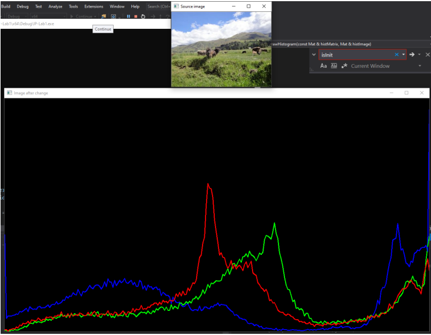
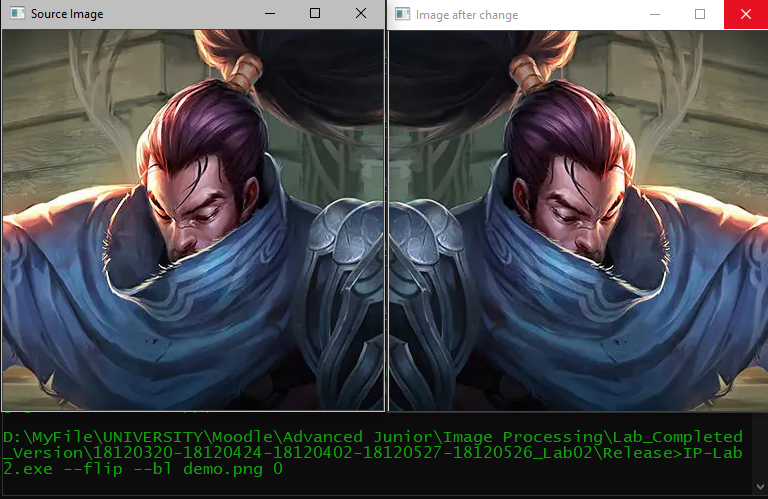
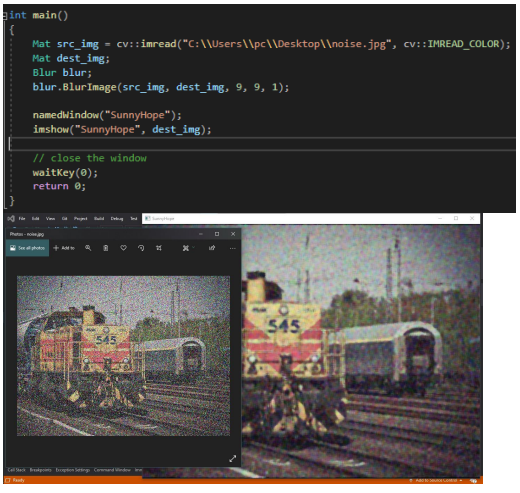
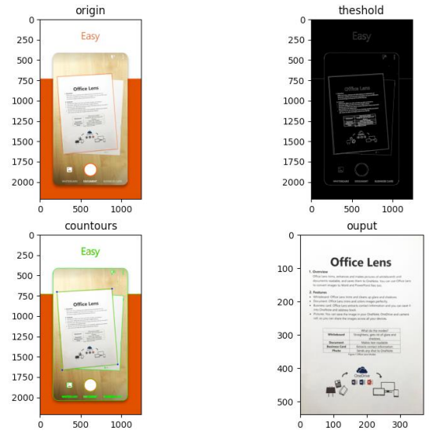

# Image Processing Labs

Image Processing Labs is a repository containing implementations of core image processing algorithms and an application utilizing them. The included modules are:

- COLOR TRANSFORMATION
- AFFINE TRANSFORM and INTERPOLATION
- CONVOLUTION
- DOCUMENT SCANNER APPLICATION

Implemented using C++ and OpenCV.

## Demos

### Color Transformation

### Affine Transform and Interpolation

### Convolution

### Document Scanner Application

## Installation

To use Image Processing Labs, follow these steps:

1. Clone this repository to your local machine.
2. Make sure you have a C++ compiler installed.
3. Install the OpenCV library.
4. Build the project using your preferred build system.
5. Run the executable.

## Usage

Once Image Processing Labs is running, you can:

- Explore and understand the implementations of core image processing algorithms.
- Utilize the document scanner application for scanning and processing documents.

## Contributing

Contributions are welcome! If you have any ideas for improvements or new features, feel free to open an issue or submit a pull request.

## Acknowledgements

- Inspired by concepts in image processing
- Implemented in C++ programming language with OpenCV library

